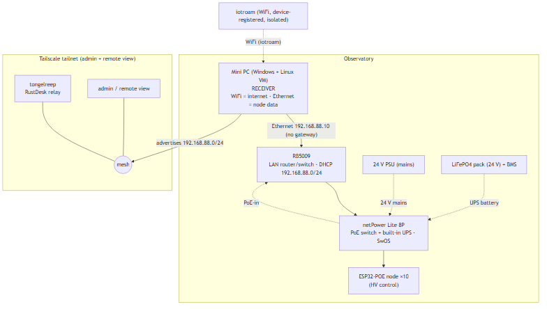
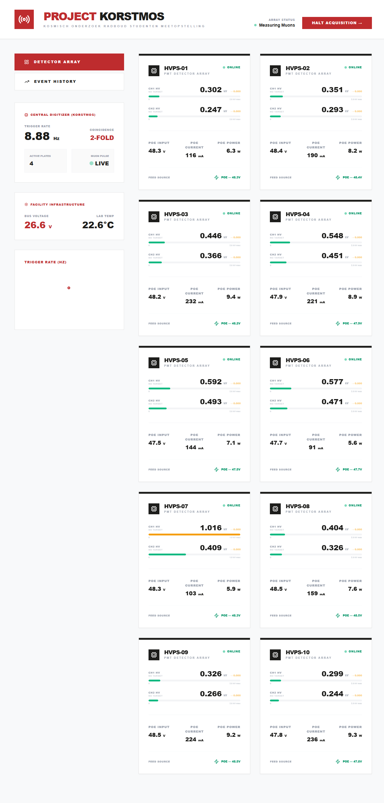
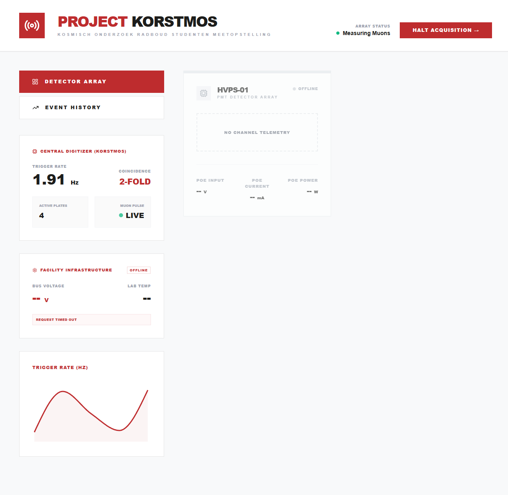
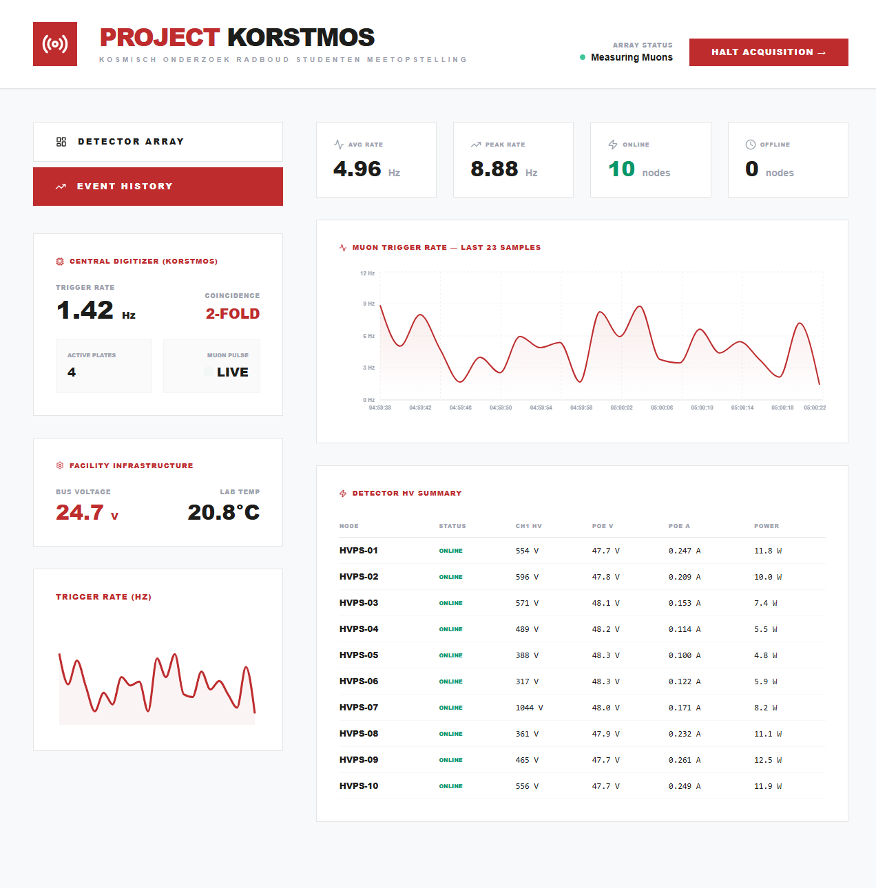
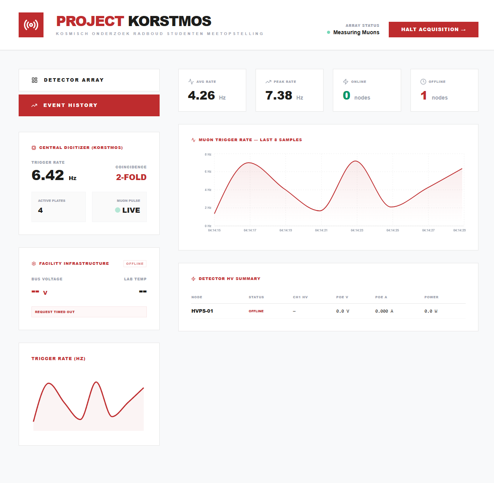
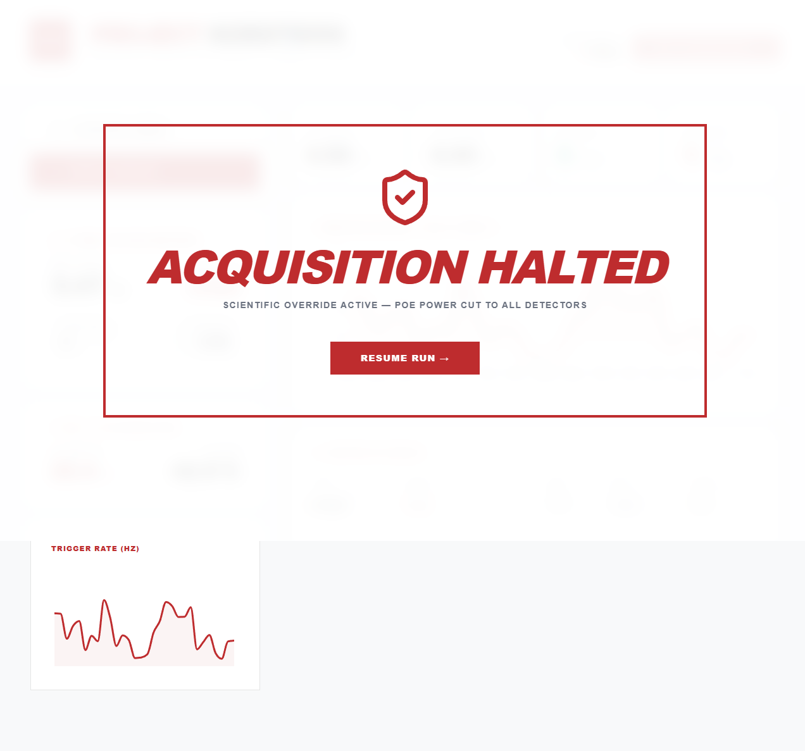

# Project Korstmos: GUI Verification Walkthrough

This document details the visual rendering review and GUI testing passes
performed across the documentation and the central monitoring dashboard of the
Project Korstmos setup.

---

## 1. Documentation Pass (rustdesk-science-login)

We performed a visual review of the project documentation to ensure proper
rendering on GitHub.

### Changes Made

1. **🥇 `INFRASTRUCTURE.md` - Mermaid Topology Diagram:**
   - Standardized the diagram syntax to use clean `"..."` double quotes,
     resolving parser errors.
   - Updated the `"UPS backup"` edge label to `"UPS battery"` to match the
     required specifications.
   - Standardized the `"advertises 192.168.88.0/24"` edge label format.
   - Verified that the diagram renders cleanly without node overlaps or text
     clipping.
2. **Syntax Highlighting & Fences:**
   - Added `text` language specifier to the startup ASCII diagram in
     `RUNBOOK.md` to prevent incorrect syntax-highlighting.
   - Added `bash` language specifier to the SSH command block in
     `ONBOARDING.md`.
3. **Clickable Internal Links:**
   - Updated cross-references across `README.md`, `ONBOARDING.md`,
     `BMC_ACCESS.md`, and `KORSTMOS-CHECKS.md` to use direct clickable links.

### Corrected Topology Diagram

Below is the compiled and verified topology diagram:



---

## 2. Dashboard GUI Testing & Fixes (poe-hvps-controller)

We conducted a visual/GUI pass on the dashboard (served at
`http://100.105.194.58:3000` over Tailscale) to check layout stability,
error/offline states, and accessibility.

### Key Bugs Identified & Resolved

1. **Stale Mock Data Masking Timeout Error:**
   - *Problem*: The dashboard initialized the Facility Infrastructure data with
     default mock values (26.4 V, 42 °C). The state-update loop only set
     incoming data if `lastSeen` was true. This completely masked backend
     timeouts, leaving misleading placeholder values visible.
   - *Fix*: Initialized the `infra` state to offline defaults and updated the
     API polling callback in `App.jsx` to always set the state, ensuring that
     the `Request timed out` error and offline statuses are rendered.
2. **Stale Feed Source Footer on Offline Cards:**
   - *Problem*: When offline, the backend node mapper returned `ups` as an
     empty object `{ battery_pct: null, source: 'unknown' }`, which evaluated
     to truthy. This caused offline cards to display a "Feed Source: MAINS OK"
     footer.
   - *Fix*: Added a check to only render the feed source footer if `isOnline`
     is true (`isOnline && ups` in `NodeCard.jsx`).
3. **Recharts Container Warnings:**
   - *Problem*: Recharts logged layout warnings in the console during the
     initial render pass when container dimensions were unresolved.
   - *Fix*: Wrapped the chart in a `minWidth={0}` block and added explicit
     sizing fallbacks.
4. **Contrast & Readability (A11y):**
   - *Problem*: Low contrast `text-gray-300` on "No Channel Telemetry" and
     tiny `text-[8px]` labels made node cards hard to read.
   - *Fix*: Boosted telemetry placeholder contrast to `text-gray-500` and
     increased metric labels to `text-[10px]`.

---

## 3. Populated GUI Validation in `DEMO_MODE`

With the integration of `DEMO_MODE=true`, we verified how the dashboard behaves
and renders with active synthesized telemetry across all 10 nodes (`HVPS-01` to
`HVPS-10`).

### Validation Findings

- **Online Telemetry Rendering:**
  - All 10 detector cards render cleanly as `ONLINE` with green pulses.
  - Active voltage and target parameters (e.g., `0.599 kV → 0.000`), active
    PoE metrics (V, mA, W), and feed source statuses are correctly displayed.
- **Facility Infrastructure Widget:**
  - The offline warning has resolved, displaying live bus voltage (`~26 V`),
    lab temperature (`~22°C`), and active CPU load.
- **HVPS-07 Safety Violation:**
  - Channel 1 `current_kv` sits above its `limit_kv` (1.0 kV).
  - **Visual Indicator**: The progress bar correctly turns from green
    (`bg-emerald-500`) to warning amber (`bg-amber-500`), and the target arrow
    turns amber (`text-amber-500`).
  - > [!IMPORTANT]
    > **Accessibility (A11y) Resolution:** We implemented explicit safety
    > warnings in `NodeCard.jsx`. When a channel exceeds its safety limit, the
    > dashboard:
    > 1. Displays a bold, pulsing red badge **[LIMIT EXCEEDED]** in the card
    >    header.
    > 2. Highlights the entire card border and institutional ribbon in warning
    >    red.
    > 3. Colors the offending channel's voltage text red and appends a flashing
    >    **[Over Limit]** label.

---

## 4. Visual Comparisons & Recorded Walkthroughs

The visual progression and live telemetry behavior are captured in the
carousels below.

### UI Screens (Populated vs. Offline)

````carousel

<!-- slide -->

<!-- slide -->

<!-- slide -->

<!-- slide -->

````

### Screen Recordings of the Setup

We captured screen recordings of the automated GUI walkthrough in both states.

````carousel

<!-- slide -->

````
