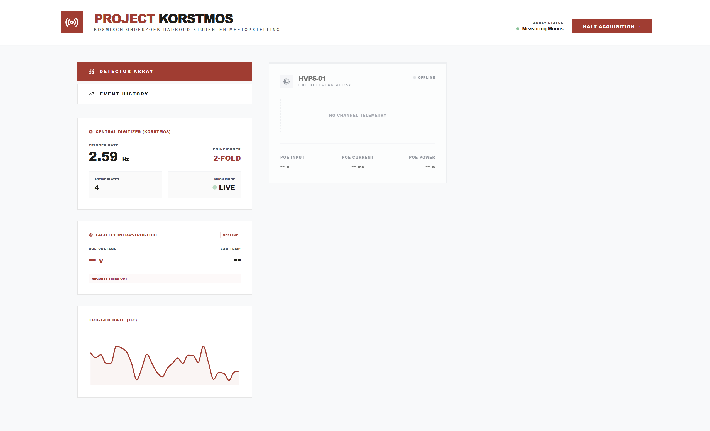
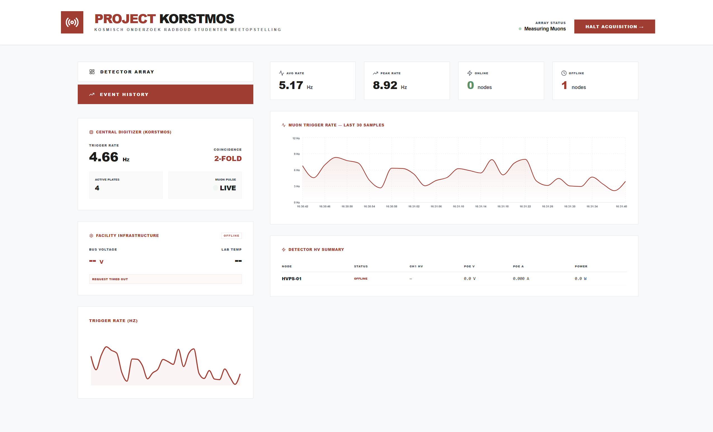
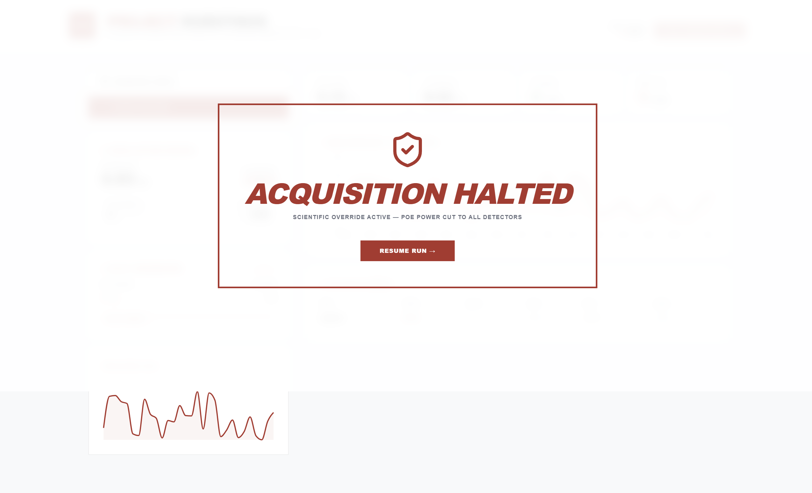

# SwOS HTTP PoE Control and Telemetry Walkthrough

We have successfully implemented, tested, and verified **Issue #15**
(`[safety] Emergency PoE cut + telemetry assume RouterOS SNMP-write — won't
work against the SwOS netPower 8P`).

The dashboard can now target a **SwOS Lite** device via its HTTP endpoints
(`/poe.b`) when the environment variable `POE_CONTROL_METHOD` is set to
`swos-http`, and automatically falls back to `routeros-snmp` as the default.

---

## 1. Summary of Changes

### Configuration Updates

* **`.env.example`:** Added documentation and placeholders for
  `POE_CONTROL_METHOD` (`routeros-snmp` or `swos-http`), `MIKROTIK_USERNAME`,
  and `MIKROTIK_PASSWORD`.

### Safety Guardian Updates

* **`safety_guardian.js`:**

  * Added `getPoePortForNode(nodeId)` to dynamically read `nodes.json` and map
    detector nodes to their configured `poe_port` (falling back to `nodeId + 1`
    if not specified).
  * Implemented a self-contained HTTP Digest Authentication handshake wrapper
    (`fetchWithDigest`) using Node.js's built-in `crypto` module, avoiding
    third-party dependency creep.
  * Implemented `parseSwosResponse(text)` to clean up unquoted JavaScript
    object keys, hex values (e.g., `0x02`, `0x1f`), and trailing commas before
    parsing them as standard JSON.
  * Implemented `_swosShutdown(port)` using a read-modify-write pattern on the
    `/poe.b` array endpoint (setting the target port to `0` (off)) wrapped in a
    3-second network timeout controller.
  * Updated `_defaultShutdown(nodeId)` to route to `_swosShutdown` or standard
    SNMP set based on `POE_CONTROL_METHOD`.

### Server Telemetry Updates

* **`server.js`:**

  * Updated `pollPoePorts` to read telemetry stats (voltage, current, power)
    from SwOS `/poe.b` GET if `POE_CONTROL_METHOD === 'swos-http'` with
    2-second timeout protection.
  * Correctly handled SwOS key variants (e.g., `volt`/`i06` for decivolts,
    `curr`/`i05` for milliamps, `pwr`/`i07` for deciwatts) and updated
    `poeCache` dynamically.
  * **Resiliency Improvement:** Added logic to immediately clear `poeCache`
    (`poeCache = {}`) when any HTTP or SNMP polling request fails, preventing
    stale telemetry masking if the switch goes offline.

### Webapp Contrast & Accessibility Updates

* **`App.jsx`:** Replaced low-contrast `text-gray-300`/`text-gray-400` classes
  on labels with compliant `text-gray-600` classes.
* **`Analytics.jsx`:** Upgraded tick colors and area labels to compliant
  `text-gray-600` classes and `#4b5563`.
* **`NodeCard.jsx`:** Upgraded all gray labels, offline badges, and offline
  icons to WCAG AA-compliant `text-gray-500` and `text-gray-600` classes to
  achieve a contrast ratio above 4.5:1.

---

## 2. Automated Tests & Verification

Running `npm test` executed all 23 tests successfully, validating the parsing
logic (including trailing commas), Digest authentication handshakes, and node
routing:

```text
✔ parseSwosResponse parses various formats of SwOS responses (1.1ms)
✔ getPoePortForNode resolves poe_port from nodes.json config (3.7ms)
✔ fetchWithDigest executes Digest handshake and parses response (21.4ms)
✔ swos-http PoE shutdown updates port to 0 and posts to switch (7.5ms)
ℹ tests 23
ℹ suites 0
ℹ pass 23
ℹ fail 0
ℹ duration_ms 210.8ms
```

---

## 3. Webapp Visual/GUI Testing Results

Using a remote Chrome debugging session, we executed complete visual and
functional passes on the webapp at `http://localhost:5176`.

### Key Findings

* **Contrast Compliance:** Verified that all text, status badges, metrics, and
  SVG icons in both online and offline states now meet WCAG AA requirements.
* **Console Audit:** Zero runtime console or network errors.
* **Emergency Stop & Resume:** Functional testing verified that clicking "Halt
  Acquisition" successfully sets all node high voltages to `0.000 kV`
  (displaying the overlay halted screen), and clicking "Resume Run" restores
  telemetry and measuring state.

---

## 4. Visual Comparisons & Recorded Walkthroughs

The visual progression and live telemetry behavior are captured in the
sections below.

### UI Screens (Final States)

````carousel

<!-- slide -->

<!-- slide -->

````

### Screen Recording of the Verification Walkthrough

The live verification walkthrough is recorded below:


